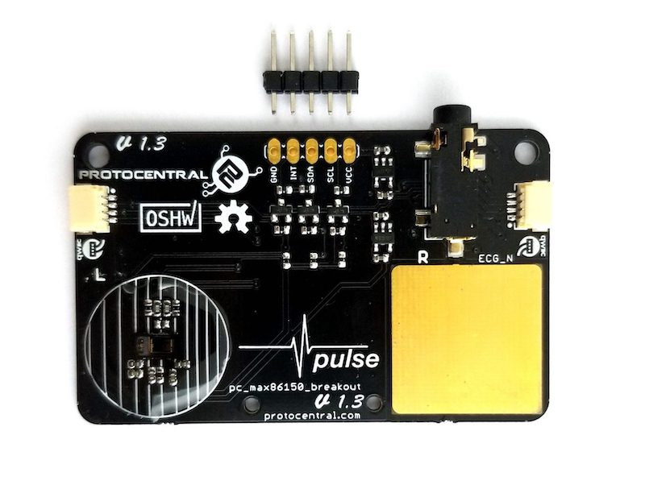
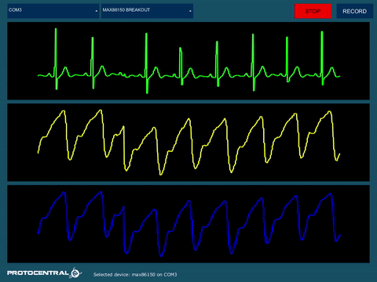

ProtoCentral MAX86150 PPG & ECG sensor
======================================

## Don't have one? [Buy it here](https://protocentral.com/product/protocentral-max86150-ppg-and-ecg-breakout-with-qwiic-v2/)

The MAX86150 breakout board is an all in one module that supports a trio of functions for human vitals monitoring. It integrates the Pulse oximeter (SPO2), Electrocardiogram (ECG) and Heart rate sensor module into this breakout board. In more scientific terms, it is integrated with the Photoplethysmogram and Electrocardiogram biosensor module.

What makes this breakout exceptional is that it is the only touch-based module available to detect both SPO2 as well as ECG. The breakout board allows Qwiic connect as well as breadboard mounting with the provided pins. It is designed to accommodate both the ECG touchpad and the external ECG stereo connector. However, they are configured in a way that they function in an exclusive manner when one mode is active the other remains passive. Any microcontroller such as Arduino is compatible and the communication protocol used is I2C to stream data. With all the above features, this board is best suited for any Mobile health monitoring as well as in wearable devices.

# Visualizing data using the ProtoCentral OpenView GUI

The GUI for visualizing the ECG and Respiration as well as parameters like Heart rate and Respiration rate is written in Processing, based on Java and is cross-compilable across platforms.

You can download and install ProtoCentral OpenView from [this GitHub Repo](https://github.com/Protocentral/protocentral_openview). You can also program your Arduino with the example sketch specific to OpenView.

Once you have opened OpenView, make sure to select "MAX86150 breakout" under the "Board" dropdown. If everything goes well, you will be able to see the screen as pictured above.

Documentation
-------------
You are free to:

* Share — copy and redistribute the material in any medium or format
* Adapt — remix, transform, and build upon the material for any purpose, even commercially.
The licensor cannot revoke these freedoms as long as you follow the license terms.
